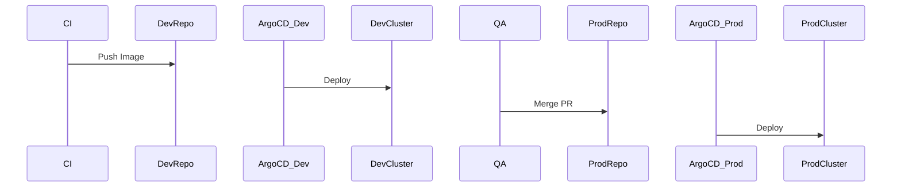

# Architecture: Multi-Cluster GitOps Promotion

## System Diagram
The following Mermaid.js sequence diagram maps the core workflow and interactions:

## Environment Promotion via Pull Requests
In this architecture, promoting a release from `staging` to `prod` doesn't involve running `kubectl apply` or clicking a button in Jenkins. 

Instead, a developer opens a Pull Request that modifies `manifests/overlays/prod/kustomization.yaml` (e.g., updating the image tag from `v1.2.0` to `v1.3.0`). Once the PR is approved and merged, Argo CD detects the change and synchronizes the production cluster.

## The ApplicationSet Controller
The `ApplicationSet` is the core of the multi-cluster strategy. Instead of defining 50 different Argo CD `Application` YAMLs for 50 different clusters, we define a single `ApplicationSet` using the **Cluster Generator**.

### How it works:
1. You register a new Kubernetes cluster to Argo CD and label it with `environment: prod`.
2. The ApplicationSet generator detects the new cluster.
3. It dynamically generates an `Application` resource, setting the destination to the new cluster and the source path to `manifests/overlays/prod` (utilizing the `{{metadata.labels.environment}}` variable).
4. The new cluster immediately begins syncing the production state.

This makes cluster bootstrapping a zero-touch operation.
